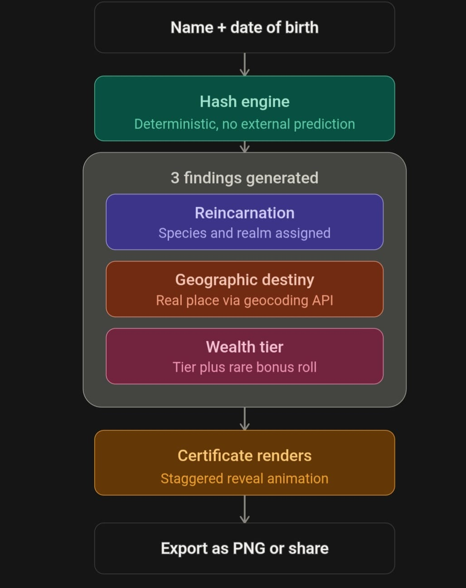

# [CERTIFATE - Destiny Generator] 🎯

## Basic Details
### Team Name: [RESPIRE]

### Team Members
- Team Lead: [Pranav Reji] - [CUSAT]
- Member 2: [Sreehari P Ranjith] - [CUSAT]

### Project Description
[CertiFate is a joke "destiny generator" — enter your name and date of birth, and a deterministic hashing algorithm spits out an official-looking certificate declaring your reincarnation form, geographic destiny]

### The Problem (that doesn't exist)
[not knowing your reincarnated life]

### The Solution (that nobody asked for)
[Now you know what happens if you would have been reicarnated]

## Technical Details
### Technologies/Components Used
For Software:
- HTML, CSS, and JavaScript
- No frameworks used
- No libraries used
- Google Antigravity (agentic IDE), Git, GitHub, browser DevTools

For Hardware:
[None]

### Implementation
For Software:
No installation or dependencies required — this is a single self-contained HTML file with no build step, no package manager, and no external libraries.

# Installation
[git clone https://github.com/pranavraj1223-blip/useless_project_temp.git
cd useless_project_temp]

# Run
[Open certifate.html directly in any modern web browser
(double-click the file, or drag it into your browser window)
No local server, no npm install, no compilation needed]
### Project Documentation
For Software:
Overview
CertiFate is a browser-based "destiny generator" built for a Useless Projects hackathon. Enter your name and date of birth, and it deterministically generates a fake official "Certificate of Predestined Destiny" — a reincarnation form, a real geo-located destiny, and an absurd wealth tier, all computed instantly with zero real prediction involved.

How it works
Name and DOB are hashed to deterministically pick results from curated lists — same input always gives the same output.
Three findings generate with a staggered reveal: Reincarnation (species + realm), Geographic Destiny (fake coordinates reverse-geocoded to a real place), and Wealth (a tiered fortune with a rare 2% easter egg).
Results render onto a certificate, exportable as PNG or shareable directly.

# Screenshots (Add at least 3)
[]
It shows the cover page for our website.

[]
It shows where u gonna type ur name  DOB.

[]
It shows the certificate generated.

# Diagrams

Scene diagrams are here.

For Hardware:Nothing much.

# Schematic & Circuit

*Add caption explaining connections*

*Add caption explaining the schematic*

# Build Photos

*List out all components shown*

*Explain the build steps*

*Explain the final build*

### Project Demo
# Video
[https://youtu.be/l232sl_noJY?si=yfKrlQJjwFcysed-]
*Explain what the video demonstrates*

# Additional Demos
[Add any extra demo materials/links]

## Team Contributions
- [Sreehari P Ranjith]: [Research]
- [Pranav Reji]: [Coding]

---
Made with ❤️ at TinkerHub Useless Projects 

